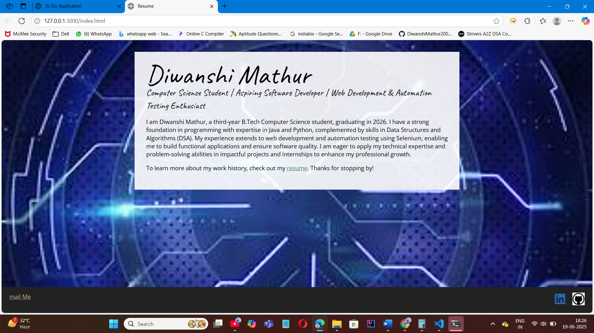
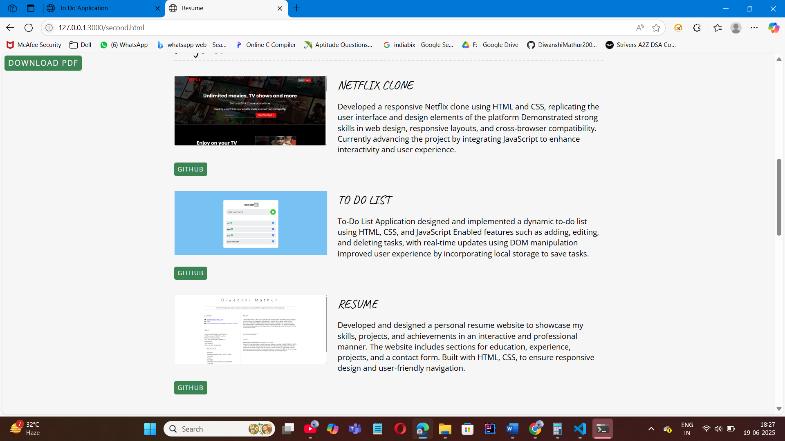
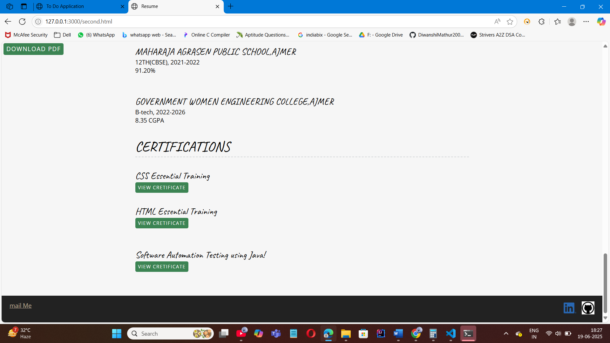

# 🌐 Personal Portfolio Website

A responsive and modern **personal portfolio website** built using **HTML**, **CSS**, and **JavaScript**. This project showcases my profile, skills, projects, education, and contact details in a clean and professional design.

---

## 🚀 Features

- 👩‍💻 About Me section  
- 🛠️ Skills overview  
- 📂 Projects showcase  
- 🎓 Education & certifications  

---

## 🛠️ Technologies Used

- HTML5  
- CSS3  
- JavaScript  
- *(Optional: Bootstrap or Tailwind CSS)*

---

## 📸 Screenshots

### 🏠 Home Section  


### 📁 Projects Section  


### 📬 Contact Section  


---
## 💻 How to Run

1. Clone this repository:
   ```bash
   git clone https://github.com/your-username/resume-site.git
   cd resume-site

